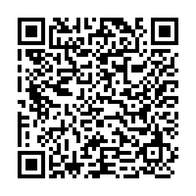

# Impuestos Bolivianos .NET


[](https://app.circleci.com/pipelines/github/alexpizarroj/ImpuestosBolivianos.Net)

Biblioteca .NET para:
* Generar Códigos de Control de Facturas.
* Generar Códigos QR de Facturas.
* Pasar Montos de Factura a Texto.

Características:
* Cumple con la [Descripción de los Números Cardinales de la Real Academia Española.](docs/CriteriosNrosCardinales2005.pdf)
* Cumple con la [Resolución Normativa "RND10-0021-16: Sistema de Facturación Virtual".](docs/RND10-0021-16.pdf)
* Cumple con la [Especificación Técnica del Código de Control Versión 7.](docs/CodigoControlV2007.pdf)
* Compatible con .NET Standard 2.0.

La biblioteca se encuentra disponible en la [sección de releases](https://github.com/alexpizarroj/ImpuestosBolivianos.Net/releases) y como [paquete NuGet](https://www.nuget.org/packages/ImpuestosBolivianos/).

## Ejemplos

### Generar Código de Control

Uso:

```csharp
var res = ImpuestosBolivianos.Facturacion.GenerarCodigoDeControl(
    nroAutorizacion,
    nroFactura,
    nitCliente,
    fechaEmision,
    importeTotal,
    llaveDosificacion);
```

Ejemplo:

```csharp
var res = ImpuestosBolivianos.Facturacion.GenerarCodigoDeControl(
    1004001364255L,
    227830,
    "2211360015",
    new DateTime(2008, 08, 24),
    46770.0m,
    "SYkajn$V4mNV8n$DiGBeNqgN+6ZViD5*Keg_sjS[BDPb%PQMADpfb3VDc6(Dz\\GL");

> "4B-A3-E1-1C-5B"
```

### Generar Código QR

Uso:

```csharp
var res = ImpuestosBolivianos.Facturacion.GenerarCodigoQr(
    nroAutorizacion,
    nroFactura,
    nitCliente,
    fecha,
    importeTotal,
    codigoControl,
    nitEmisor,
    importeBaseCf,
    importeIceIehdTasas,
    importeVentasNoGravadas,
    importeNoSujetoCf,
    descuentosBonosRebajas);
```

Ejemplo:

```csharp
var res = ImpuestosBolivianos.Facturacion.GenerarCodigoQr(
    471625511829685L,
    876814,
    "7904006306693",
    new DateTime(2008, 5, 19),
    35958.60m,
    "7B-F3-48-A8",
    "1665979",
    35958.60m,
    0.00m,
    0.00m,
    0.00m,
    0.00m);

res.Texto
> "1665979|876814|471625511829685|19/05/2008|35958.60|35958.60|7B-F3-48-A8|7904006306693|0|0|0|0"

res.BytesPng
> (abajo: visualización de bytes de imagen)
```



### Pasar Monto a Texto

Uso:

```csharp
var res = ImpuestosBolivianos.Facturacion.PasarMontoATexto(monto);
```

Ejemplo:

```csharp
var res = ImpuestosBolivianos.Facturacion.PasarMontoATexto(1000.5m);

> "UN MIL 50/100"
```
